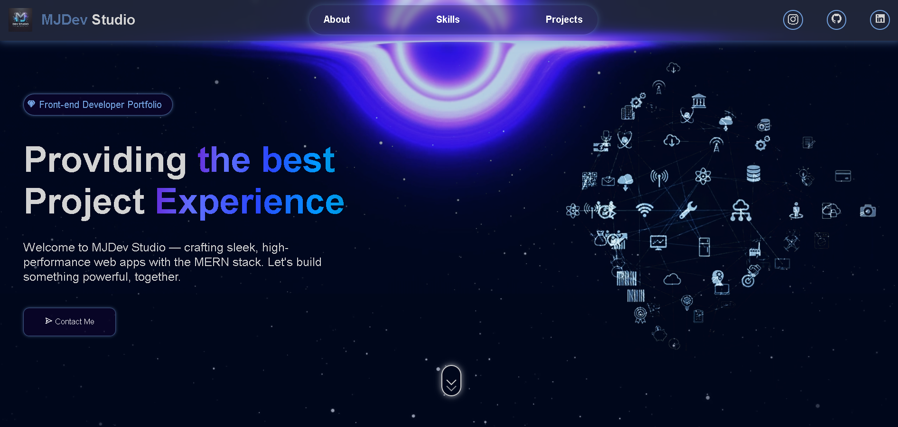

# 🌐 MJDev Studio Portfolio v2

A modern, fully responsive portfolio website designed to showcase your skills, projects, and contact information. Built using **HTML**, **CSS**, and **JavaScript**, with interactive elements and EmailJS integration for contact functionality.

## 🚀 Live Demo

🔗 [View Live Demo](https://mjportfoliov2.vercel.app/)



---

## ✨ Features

* 🎬 Animated hero section with background video
* 📱 Mobile-first sidebar navigation
* 🧩 Interactive project showcase with embedded video previews
* 📊 Skills carousel with animated slider
* ✉️ Contact form powered by [EmailJS](https://www.emailjs.com/)
* 💻 Fully responsive for all screen sizes

---

## 🛠️ Getting Started

### 1. Clone the repository

```bash
git clone https://github.com/yourusername/portfolio-website-v2.git
cd portfolio-website-v2
```

### 2. Run the site

Simply open the `index.html` file in your browser.

### 3. EmailJS Setup

To enable the contact form:

* Replace `"YOUR_PUBLIC_KEY"` inside [`index.html`](index.html) with your actual EmailJS public key.
* Update the `serviceID` and `templateID` inside [`app.js`](app.js) with your actual EmailJS credentials.

---

## 📁 Project Structure

```
portfolio-website-v2/
│
├── index.html
├── style.css
├── app.js
└── assets/
    ├── images/
    └── videos/
```

---

## 🧩 Customization Guide

* **🖼️ Images & 🎞️ Videos:**
  Replace the files inside `assets/images` and `assets/videos` with your own media.

* **🛠 Projects Section:**
  Edit the Projects area in [`index.html`](index.html) to update or add your work.

* **📫 Contact Details:**
  Update email addresses and links in both the form and footer.

---

## 🔌 Dependencies

This project uses the following external libraries:

* [📦 Boxicons](https://boxicons.com/)
* [🎨 Font Awesome](https://fontawesome.com/)
* [✨ AOS - Animate On Scroll](https://michalsnik.github.io/aos/)
* [📧 EmailJS](https://www.emailjs.com/)

---

## 🧑‍💻 Author

**Muhammad Jalal**
🔗 [mjdevstudio (LinkedIn)](https://www.linkedin.com/in/mjdevstudio/)
📁 [MJ Dev Studio GitHub](https://github.com/jalal1122/)

> Made with ❤️ for passion, progress, and the portfolio that speaks.

---
